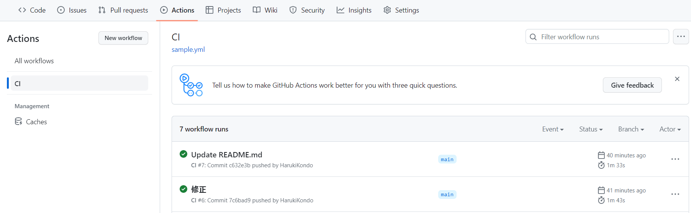
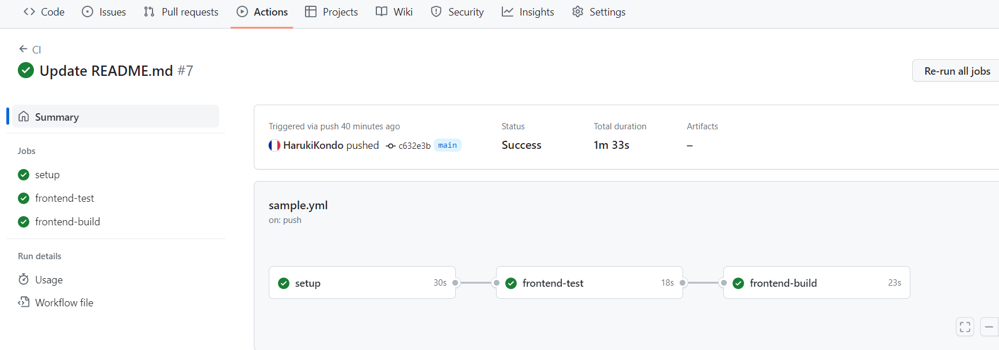
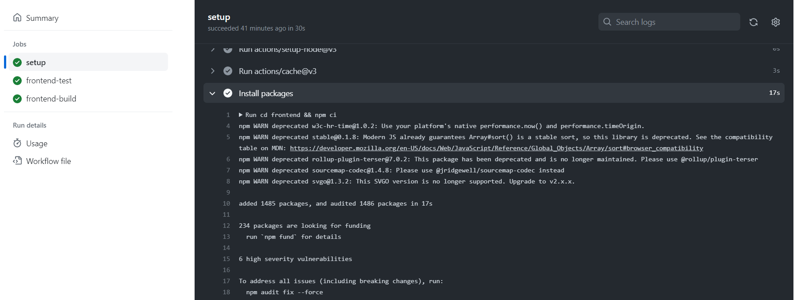
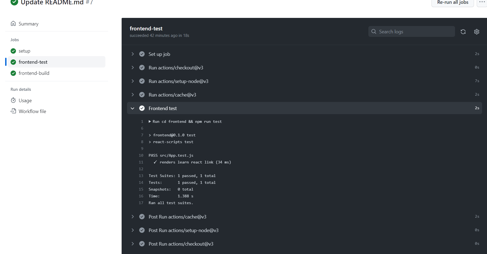
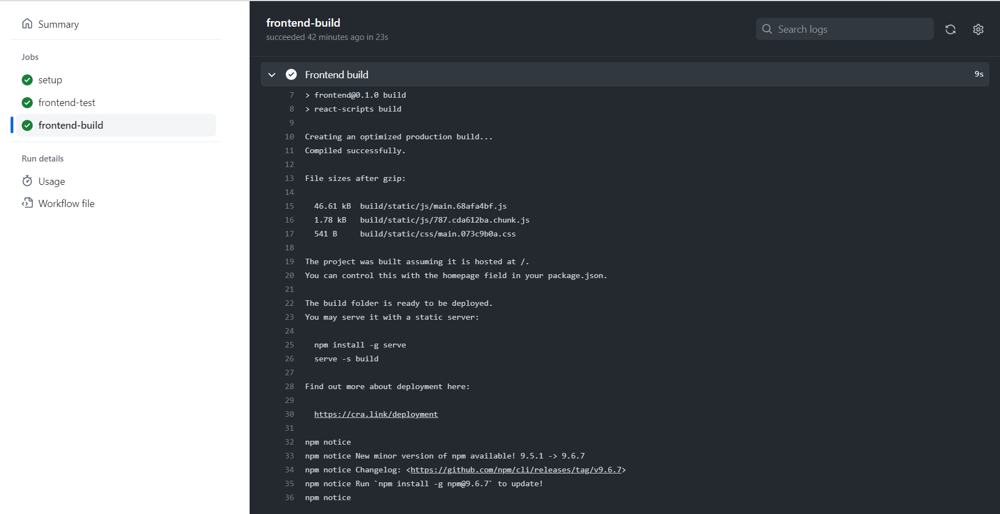
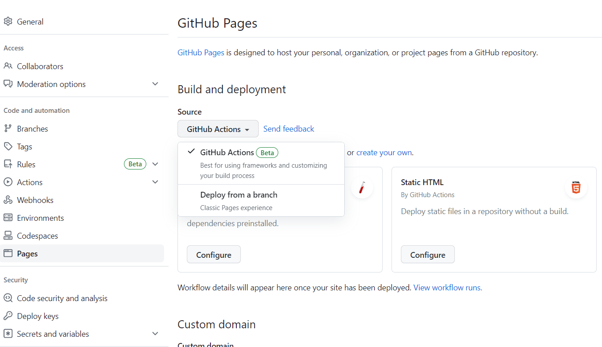
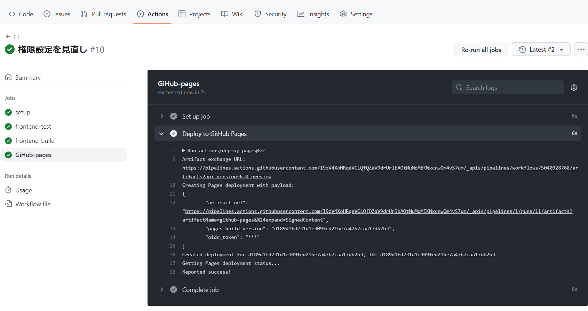

# GitHubActionSample
GitHubActionSample

### 今回作成したサンプル用の CI/CDファイル

```yml
name: CI

on: [push]

jobs:
  # npm モジュールのインストール
  setup:
    runs-on: ubuntu-latest
    steps:
      - uses: actions/checkout@v3
      - uses: actions/setup-node@v3
      - uses: actions/cache@v3
        id: npm-cache
        with:
          path: "**/node_modules"
          key: ${{ runner.os }}-${{ hashFiles('**/package-lock.json') }}-{{ checksum "patches.hash" }}
      - name: Install packages
        run: cd frontend && npm ci

  # フロントエンドのテスト実施
  frontend-test:
    runs-on: ubuntu-latest
    needs: [setup]
    steps:
      - uses: actions/checkout@v3
      - uses: actions/setup-node@v3
      - uses: actions/cache@v3
        with:
          path: "**/node_modules"
          key: ${{ runner.os }}-${{ hashFiles('**/yarn.lock') }}
      - name: Frontend test
        run: cd frontend && npm run test
        env:
          CI: true

  # フロントエンドのビルド
  frontend-build:
    runs-on: ubuntu-latest
    needs: [frontend-test, setup]
    steps:
      - uses: actions/checkout@v3
      - uses: actions/setup-node@v3
      - uses: actions/cache@v3
        with:
          path: "**/node_modules"
          key: ${{ runner.os }}-${{ hashFiles('**/yarn.lock') }}
      - name: Frontend build
        run: cd frontend && npm run build
        env:
          CI: false
```

### 実際に動作した GitHub Actionの例

- 動作記録

    

- 実行されたワークフロー一覧
    npmモジュールのインストール⇒テスト⇒ビルド

    

- npmモジュールのインストール Action

    sample.ymlファイルで定義されたコマンドが実行されてモジュールがインストールされている。

    

- フロントエンドのテスト Action

    sample.ymlファイルで定義されたコマンドが実行されてApp.tsxのコンポーネントがレンダリングされているかのテストが実行されている。

    

- フロントエンドのビルド Action

    sample.ymlファイルで定義されたコマンドが実行されてフロントエンドのビルドが行われている。

    

- リポジトリの設定ファイルから、GitHub Actionsによる成果物の公開設定をONにする。

  

- GitHub pagesでのデプロイ Action

  